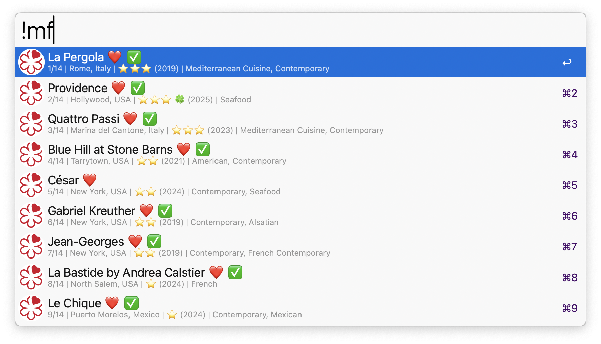
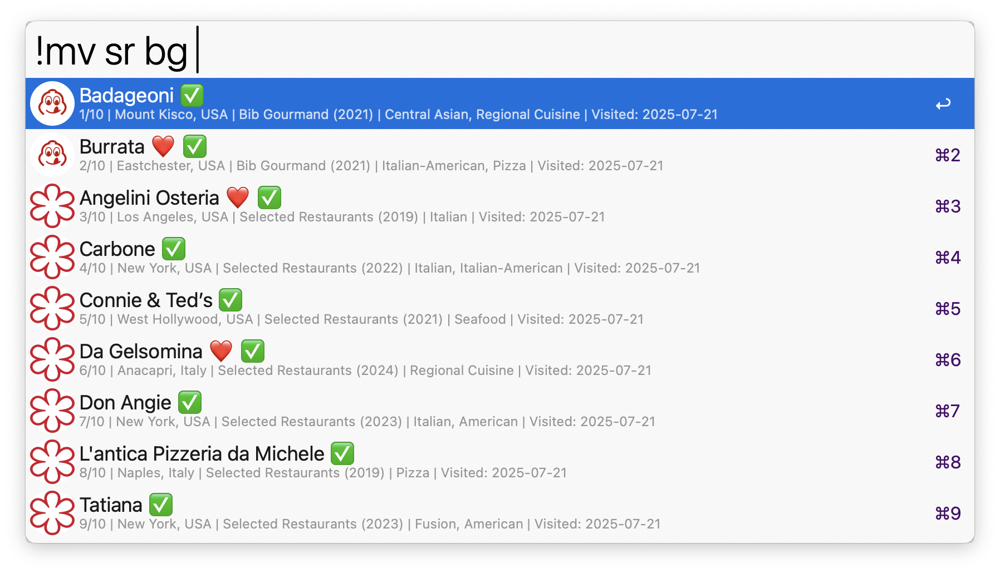

## Usage

Search for Michelin restaurants by name, location, cuisine, or distinction via the `!mm` keyword.

* <kbd>↩</kbd> Open restaurant website.
* <kbd>^</kbd><kbd>↩</kbd> Add or remove from favorites.
* <kbd>⌘</kbd><kbd>↩</kbd> View award history.
* <kbd>⌥</kbd><kbd>↩</kbd> Add or remove from visited.
* <kbd>⇧</kbd><kbd>↩︎</kbd> Show more details.

Search is case-sensitive when it includes uppercase letters. Awards can be searched via the `3s`, `2s`, `1s`, `bg`, `gs`, or `sr` keywords.

Narrow results by country or US state with `country:japan` or `state:ca`, and append `--current` to show only restaurants currently in the 2026 guide. Tokens can be combined, e.g. `!mm state:ca 3s` or `!mm country:france gs`.

List and search all your favorite and visited restaurants via the `!mf` and `!mv` keywords.

Configure the Hotkeys for faster triggering.
