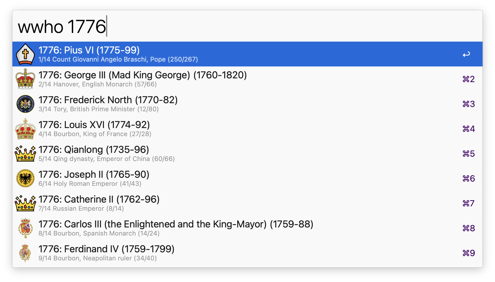
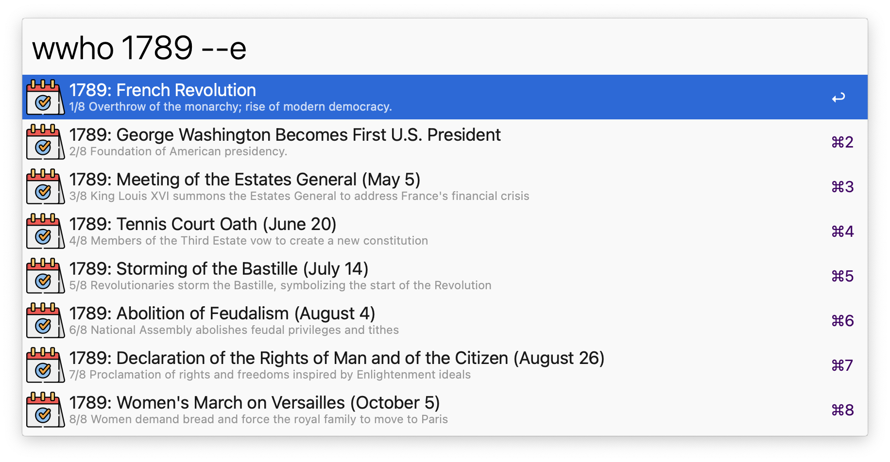
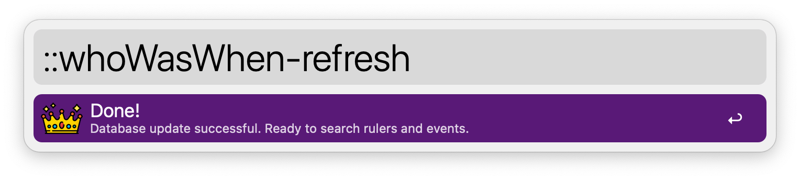

## Usage

Search for historical names, titles, years, or events via the `wwho` keyword. 

Filter for events only via the `--e` search flag.

* <kbd>↩</kbd> Show the Wikipedia page of the ruler (or event, if available).
* <kbd>⌃</kbd><kbd>↩</kbd> “Travel” to the first year of the ruling period or event.
* <kbd>⌘</kbd><kbd>↩</kbd> “Travel” to the last year of the ruling period or event.
* <kbd>⌥</kbd><kbd>↩</kbd> Show the list of rulers with that title (e.g. “English monarch”).
* <kbd>⇧</kbd><kbd>↩</kbd> Copy the info about the ruler or event to the clipboard.
* <kbd>⌘</kbd><kbd>⌥</kbd><kbd>↩</kbd> Return to the main search.

Refresh the master database at intervals set in the Workflow’s configuration, or manually via the `::whoWasWhen-refresh` keyword.

## Companion iPhone app

The same history at your fingertips when you’re away from your Mac. 

